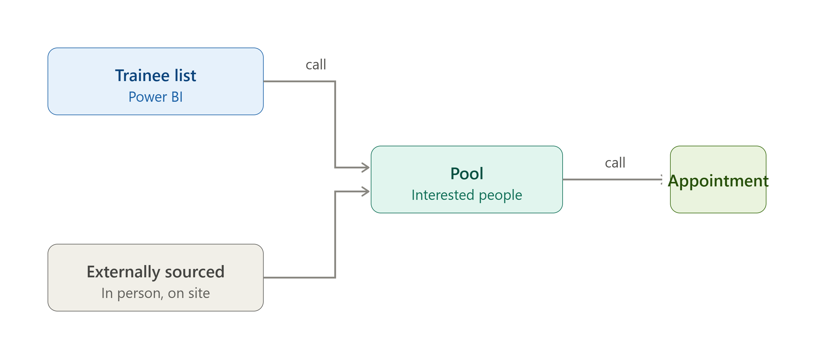

# Psychotechnical Renewal Tracker


[Run the public demo](#run-the-public-demo) — synthetic sample data, no private files or API key required.

| | |
|---|---|
| **Business impact** | Prioritizes upcoming psychotechnical renewals and supports contact follow-up through status-based lists. |
| **Tools** | Power BI, Power Query, DAX |
| **Status** | Operational deployment uses M365 sources and scheduled Power BI Service refresh; public demo uses local files and manual refresh. |


**TL;DR:** A Power BI report for a driving school. It tracks when commercial drivers' psychotechnical assessments are due for renewal and turns the ones coming up into a call list. The goal wasn't to discover something new. It was to take work already being done and make it faster, repeatable, and easier to follow.

## Context

In Turkey, psychotechnical assessment became mandatory for drivers of commercial vehicles after 30 June 2021. People who got their licence before that date were included too. The assessment has to be renewed every five years.

For a driving school, that means hundreds of people need reassessment at regular intervals, and someone has to keep track of whose turn is coming up when. The report recalculates renewal dates and call priorities when the model refreshes; staff record call outcomes and arrange appointments.

## What the system does

It first filters the driving school data down to people who hold a C, D, or E class licence. Then, for each person, it works out the next test date, shows whose turn is approaching, and rebuilds the call list on model refresh. Three pieces make that possible.

**Anchor.** A start date for each person. If the licence was issued before 30 June 2021, the anchor becomes that day; otherwise it's the real licence date. The regulation collapses into a single column.

**Next Test.** Starting from the anchor, it steps forward in five-year cycles and finds roughly when the person's next test falls. Whatever point of the cycle someone is in, the system finds the right date on its own. The purpose is targeting. Instead of calling trainees at random, we call the ones whose turn is approaching, not the ones whose time hasn't come yet.

**Status.** Based on the months left until the next test, everyone falls into a group: Overdue, Due now, Upcoming, Later. The people to call come out of these groups.

The same logic runs for the pool. The trainee list feeds the pool, and for people in the pool the next test date is calculated and grouped by status as well. The user sees whose date is approaching through Power BI and calls them to let them know when their time comes.

The Overdue group was kept deliberately narrow, showing only those whose date passed within the last three months. The aim is to keep the call list manageable. If the window were wide, the list would get crowded and the people who genuinely need calling right now would get lost.

## Who it covers

Only C, D, and E class commercial licences. Motorcycle and automobile licences were left out of the system. Those classes are often held for personal use rather than commercial work, so most of their holders aren't interested in psychotechnical renewal. Leaving them out spends calling time on the people actually worth calling.

## What happens to the people who get called

In the operational workflow, staff save the call outcome in the source records. The model picks up that outcome on the next successful refresh that reads the updated source.

Interested people get added to the pool. The pool is fed from two sources: people found externally and trainees who, when called, say they're interested. Each person in the pool carries a source tag, so the user can see whether the person came from the course or from outside. The point of the pool is to reach these people and set up an appointment when their psychotechnical date comes due.

The operational call list uses a status filter to exclude people whose call outcome has been recorded and loaded into the model. This helps avoid repeat calls once the refreshed results are visible. An open report may also need its visuals refreshed before the updated list appears.



## Numbers

Two published summaries appear in this repository. They use different denominators, and the available records do not establish a common reporting period or filter context.

| Source | Numerator | Denominator | Rate | Reporting period / snapshot date |
|---|---|---|---:|---|
| Reported trainee-call summary | 648 people who shared their psychotechnical date | 1,092 trainees called | 59.34% | Not specified |
| [Insights screenshot](docs/dashboard.md#insights) | 211 records labelled "Interested" | 396 classified records: 211 interested + 185 not interested | 53.28% | Not specified |

Sharing an assessment date is used as an interest proxy in the trainee-call summary. The screenshot's "Contact Success Rate" reports the share labelled "Interested" in its displayed records. Neither rate measures completed assessments, appointments, sales, or revenue.

The screenshot's 396 records have not been confirmed as a subset of the 1,092 called trainees. The dates shown on neighbouring charts do not establish the pie chart's reporting window. Without matching cohort, date, and filter information, the two rates cannot be combined or interpreted as improvement or decline.

These are reported observations from the original project, not current live totals or results generated by the synthetic public demo. The shared anchor date can concentrate estimated renewals into one period; these contact summaries do not measure the current backlog or how much it has fallen.

## Update: Automated Cloud Refresh Pipeline

The operational deployment is documented as using Microsoft 365 cloud sources with scheduled model refresh. Automation covers data import and model recalculation; staff still enter call outcomes in the source records.

| Environment | Data source | How the model updates |
|---|---|---|
| Operational deployment | SharePoint/OneDrive cloud sources | Scheduled semantic model refresh in Power BI Service, or an on-demand refresh |
| Public demo in this repository | Local synthetic Excel files under `DemoDataFolder` | **Refresh** in Power BI Desktop |

Source changes reach an Import model after a successful data refresh. An already-open Service report may then need **Refresh visuals** or reopening to show the updated results. Saving a source file or refreshing report visuals alone does not import changed data. See [Microsoft's data-refresh documentation](https://learn.microsoft.com/en-us/power-bi/connect-data/refresh-data).

The public model's calculated renewal dates and statuses use `TODAY()` and are recalculated during model refresh. They do not continuously update while a report remains open. See [Power BI calculated-column behaviour](https://learn.microsoft.com/en-us/power-bi/transform-model/desktop-calculations-options#calculated-columns-dax).

Cloud connections, credentials, refresh schedules, and refresh history belong to the private Service deployment. The downloadable project demonstrates local Import-mode behaviour; it does not configure that cloud deployment or establish its refresh frequency or latency.

## SQL evidence

The [self-contained SQLite companion](sql/README.md) demonstrates the two-regime renewal anchor, five-year cycles, prioritized call queue, contact denominator, source-tagged pool, and data-quality controls on invented records. Run `python sql/run_demo.py`; the repository's unit-test command also verifies it. Its synthetic KPI remains separate from the two published summaries with undocumented cohort and date relationships.

## Run the public demo

The public demo uses **fully synthetic data**, generated locally without private files, credentials, or API requests. Demo figures are illustrative and do not reproduce the [reported business results](#numbers).

1. Download this repository (Code → Download ZIP) and extract it, or clone it.
2. Install Python 3.10+ and a current Power BI Desktop for Windows with PBIP/TMDL support.
3. Close the project in Power BI Desktop, then run these commands from the repository folder:

```bash
python -m pip install -r requirements.txt
python scripts/setup_demo.py
```

4. Open `pbip/Psiko Demo.pbip` and select **Refresh**.

The script writes the sample workbooks to `demo-data/` and updates the single `DemoDataFolder` Power Query parameter in the local project. If you move the repository, close Power BI Desktop and run the setup command again. To use another sample-data location, run `python scripts/setup_demo.py --data-dir "path/to/demo-data"`. You can also edit `DemoDataFolder` through **Transform data → Manage Parameters**.

Python can generate the files on Windows, macOS, or Linux; opening the report requires [Power BI Desktop](https://learn.microsoft.com/en-us/power-bi/developer/projects/projects-overview). No Power BI Service workspace or cloud refresh setup is required for this local demo. If a map requests an online map service, the remaining report pages can still be reviewed offline.

The sample workbooks are anchored to 2026 and contain invented identities and records, with matching keys across related tables. Renewal dates and status buckets use the date at model refresh through `TODAY()`, so they can change on a later refresh even when the sample files are unchanged. Existing screenshots and operational results describe the original project; their totals will differ from this demo.

Run the automated source-data and relocation checks with:

```bash
python -m unittest discover -s tests -v
```
