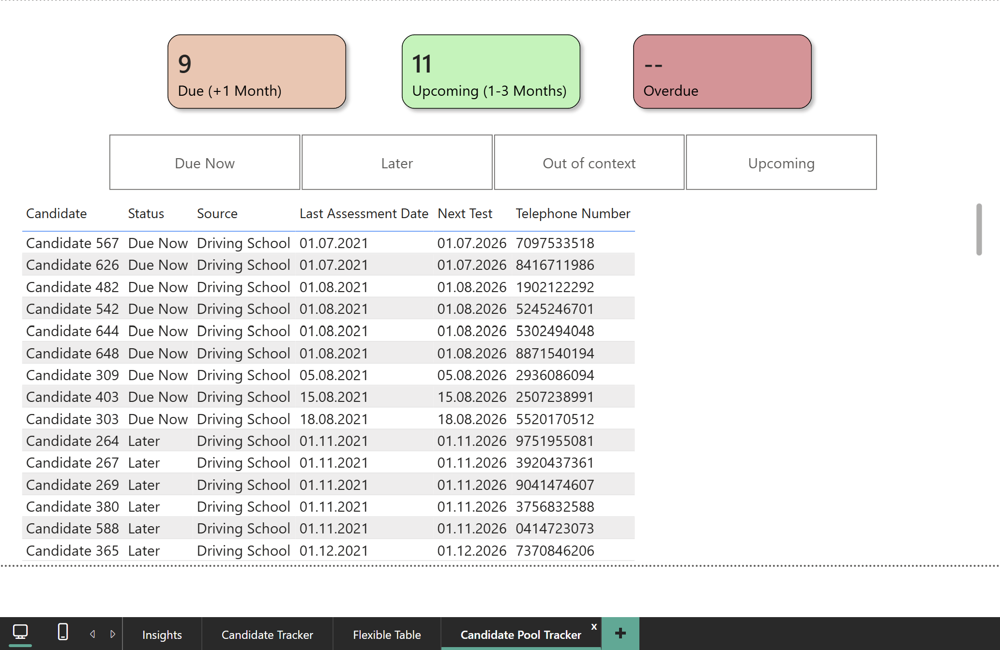
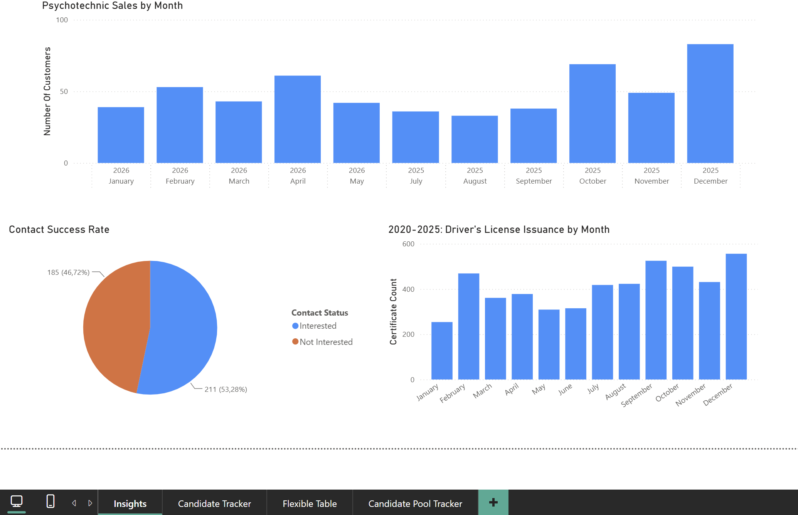
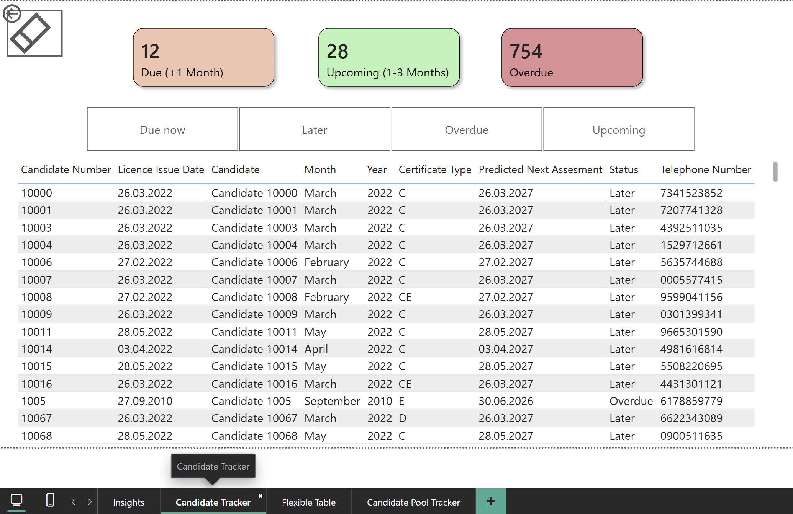
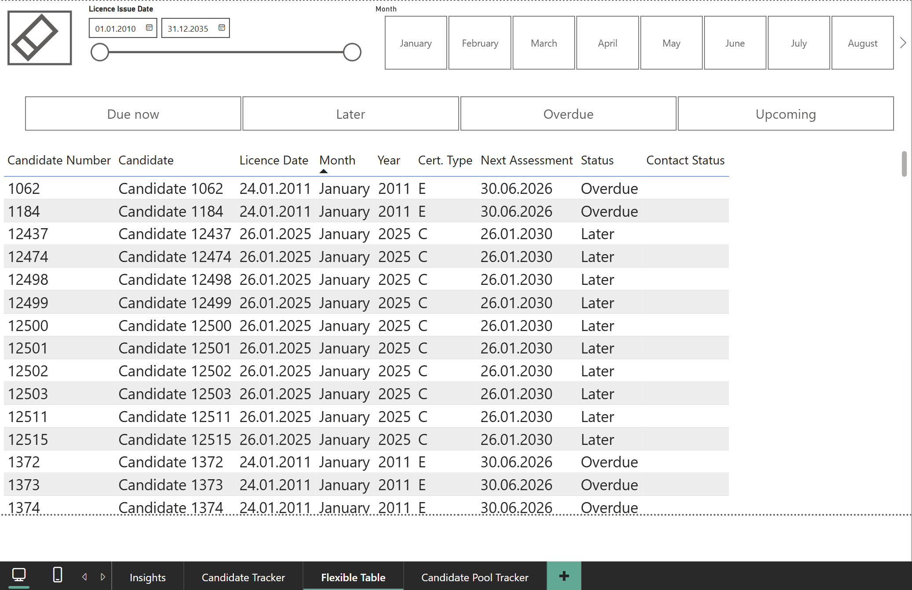

# Dashboard

Four report pages, built in Power BI. Candidate names, numbers, and phone numbers are anonymized. Dates and license classes are real, since the data belongs to the driving school and no external party's data is involved.

These screenshots document the original report. Their figures differ from the synthetic public demo; the reported metric definitions and period limitations are recorded under [Numbers](../README.md#numbers).

The displayed lists reflect the last successful model refresh. The documented operational deployment uses scheduled Power BI Service refresh; the public demo requires **Refresh** in Power BI Desktop. An open Service report may also need its visuals refreshed to display newly imported results. Date-dependent status columns are recalculated on model refresh. See [refresh behaviour](../README.md#update-automated-cloud-refresh-pipeline).

---

## Candidate Pool Tracker

The pool: people who've already been called and said they're interested, whether they came from the trainee list or were found externally. This page shows who's due for an appointment and lets the user filter by status before calling.

## Insights

The overview page includes a monthly chart, contact-status distribution, and driver's licence issuance history.

The pie chart labelled "Contact Success Rate" shows **211 interested + 185 not interested = 396 classified records**. Its displayed rate is **211 / 396 = 53.28%**. This measures the share marked interested, not assessment completion or sales conversion.

The README's separate trainee-call summary is **648 / 1,092 = 59.34%**, based on people who shared their psychotechnical date. The screenshot's capture date, reporting window, and filter context are not recorded, and its 396 records have not been confirmed as a subset of those 1,092 trainees. The neighbouring charts' dates do not establish the pie chart's scope. See [Numbers](../README.md#numbers) for both definitions; the two percentages do not establish a trend.

## Candidate Tracker

The full trainee list, classified into Due, Upcoming, Overdue, and Later. This is the source list before anyone's been called, and the large Overdue and Later counts reflect the regulatory transition bubble described in the README.

## Flexible Table

The same trainee data, filterable by date range and month, for anyone who needs to narrow the list down further than the fixed status buckets allow.
