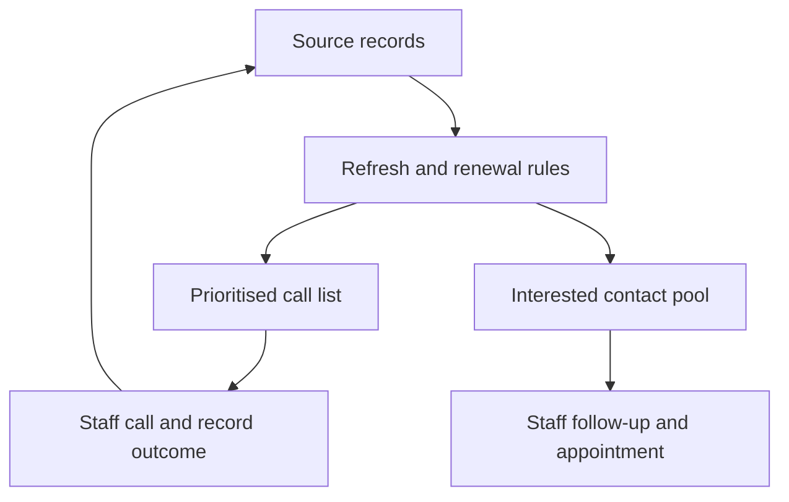

# Renewal outreach: the decision workflow

[Project overview](../README.md) · [Full project story](story.md) · [SQL implementation](../sql/README.md)

**Business question:** How can staff identify approaching renewals, contact the right customers at a useful time and use recorded outcomes to decide the next action?

## What I designed and why

| Operational need | Design decision | What staff can do |
|---|---|---|
| Avoid reviewing every licence record by hand | Apply the project's date anchor and five-year cycle rules, then classify the renewal window. | Find records in Overdue, Due now and Upcoming groups. |
| Keep outreach manageable | Limit the overdue window and separate later renewals. | Focus the current list instead of mixing all historical records together. |
| Carry a contact forward | Keep interested trainees and externally sourced people in a source-tagged pool. | Follow up when an assessment date approaches. |
| Use the outcome of the previous call | Read staff-entered outcomes during model refresh and exclude recorded outcomes from the open call list. | Avoid repeatedly working through the same completed contact records after a successful refresh. |

These decisions are documented in the [project story](story.md#what-the-system-does). The date rules are the project's targeting assumptions; individual renewal dates still require validation against the person's actual assessment history.

## Operational flow

The operational deployment uses Microsoft 365 sources and scheduled Power BI Service refresh. Staff make calls, enter outcomes and arrange appointments. Source edits affect an Import model after a successful data refresh; an open report may also need its visuals refreshed.

The public Power BI demo uses local synthetic files and manual Desktop refresh. Its model uses the date at refresh; the SQL companion uses the fixed **2026-09-08** reference date for reproducible tests.

## Inspectable delivery

| Layer | Available evidence | Scope |
|---|---|---|
| Business and process | [Original narrative](story.md) and the flow above | Describes the operational use and design reasoning. |
| Source and model | [SQL data dictionary](../sql/DATA_DICTIONARY.md), [raw schema](../sql/01_raw_schema.sql), [Power BI model](../pbip/) | Public inputs are synthetic; raw source fields remain inspectable. |
| Preparation and validation | [Staging](../sql/02_staging.sql), [quality checks](../sql/04_quality_checks.sql) | Invalid data is separated from actionable records and reported for correction. |
| Repeatable delivery | [Snapshot loader](../sql/run_demo.py), [regression tests](../tests/test_sql_demo.py) | Tests repeated loading into the same connection and changed source snapshots. This is full-snapshot replacement. |
| Reporting | [Dashboard walkthrough](dashboard.md), [SQL results](../sql/RESULTS.md) | The committed SQL snapshot identifies its date and synthetic population. |
| Continuous checks | [GitHub Actions](https://github.com/dogantunagerguz/psychotechnical-renewal-tracker/actions/workflows/ci.yml) | Runs the Python/SQL suite; it does not execute Power BI Desktop or verify private Service refreshes. |

The SQL companion is an independently runnable portfolio extension. The validation and loading behaviour implemented there must be integrated and accepted separately before use in the operational Power BI workflow.

## Metric interpretation

The exact implemented SQL formulas and fields are documented in the [data dictionary](../sql/DATA_DICTIONARY.md).

| Metric | Population and date scope | Intended use | Current status |
|---|---|---|---|
| Open priority queue | Uncalled commercial-licence records in eligible renewal groups at the SQL reference date, passing the implemented identity, date and contact-reference checks | Review the next contacts | Implemented in the SQL demo; a contact reference does not establish that a phone number is reachable. |
| Interest rate among classified called records | Interested / (Interested + Not interested), using valid classified records; the current source is a snapshot rather than a dated call history | Understand the recorded contact outcomes | Implemented as a proxy. It does not measure completed renewals. |
| Data-quality exceptions | Counts by validation rule for the loaded snapshot; the same source row may fail more than one rule | Find records needing source correction | Implemented checks; rule counts must not be added and treated as unique bad customers. |
| Timely contact | Distinct eligible renewal cycles with a contact within an agreed window / all eligible cycles whose contact window has closed | Check whether due work was addressed on time | Proposed; requires dated contact events and an agreed window. |
| Renewal completion | Distinct eligible renewal cycles with verified completion by an agreed deadline / all eligible cycles with a complete observation period | Review completed service uptake | Proposed; requires cycle IDs and verified completion records. |

The reported **648 / 1,092** date-sharing summary and **211 / 396** screenshot result remain separate populations. Neither is a measured renewal-completion rate. See [their definitions and missing period information](story.md#numbers).

## Proposed event records

The following fields are a design for the next phase, **not fields currently captured by this demo**:

| Proposed entity | One row represents | Key and example fields |
|---|---|---|
| Customer | A resolved customer identity | customer_id; source-to-customer mapping; contact reference |
| Renewal cycle | One renewal obligation for a customer | renewal_cycle_id; customer_id; verified prior assessment date; due date; rule version |
| Contact attempt | One attempted contact | contact_attempt_id; renewal_cycle_id; attempted_at; staff_id; outcome; next_action_at |
| Appointment / completion | An appointment or verified assessment event | event_id; renewal_cycle_id; scheduled_at; completed_at; status; evidence reference |

A new attempt must add an event rather than overwrite the previous attempt. A genuine new renewal cycle must remain distinguishable from a duplicate load of the same source record. Stable identity across trainee and external sources needs a business-approved matching rule.

## Operating agreement to complete with the business

| Item | Required decision / evidence | Status |
|---|---|---|
| Decision owner | Who approves priority rules and acts on the weekly review? | To be named. |
| Calling capacity | Available staff time and expected daily contacts; how deferred work is handled | To be agreed; no capacity value is assumed. |
| Refresh and source ownership | Actual refresh frequency, source editor and model owner | Scheduled refresh is described; frequency and named responsibilities require operational confirmation. |
| Exception handling | Who resolves each type of source error, by when, and how recurrence is tracked | Proposed operating process. |
| Failure notification | Recipient, notification route and escalation rule | To be configured and demonstrated. |
| User acceptance | Staff can select a valid priority record, record an outcome and see the expected change after refresh | Test script to run in the operational environment. |
| Review period | Fixed cohort, contact window and enough follow-up time for completion | To be agreed before measuring impact. |

## Impact review

Capture comparable baseline and follow-up periods, staff time, eligible renewal cycles, attempted contacts and verified completions. Review differences in staffing, backlog, urgency mix and seasonal demand before interpreting a before/after change.

The wider engagement's [author-reported 7-to-2-hour weekly reporting reduction](https://github.com/dogantunagerguz/driving-school-targeting-and-finance/blob/main/docs/story.md#operational-delivery-notes) is shared context. It is not a measured effect of this renewal project alone. This repository does not yet establish timely-contact improvement or incremental renewal conversion.
